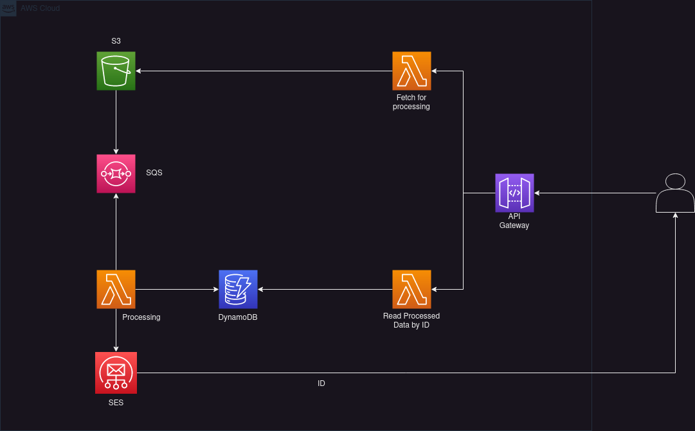

# Python Serverless fake processing

Application which makes fake processing. 

## Endpoints

- POST /process - Request proccessing of fact. The fact data is strored on S3. S3 PutObjects event is sent to SQS queue. Other lambda is pulling messages from SQS, saves it to DynamoDB and sends email to the user with ID of created resource.
- GET /facts/<fact_id> - Get processed item from DynamoDB.

## Infrastructure overview

## Instructions for deploying by AWS console.

1. Create Role for ProccessFactLambdaFunction with custom policy with S3PutObject permission and AWSLambdaBasicExecutionRole
2. Create Role for ProcessingLambdaFunction with AWSLambdaSQSQueueExecutionRole, AmazonS3ReadOnlyAccess, custom SES policy with SendEmail and SendRawEmail permissions and custom DynamoDB policy with PutItem permission.
3. Create Role for ReadFactLambdaFunction with custom policy with DynamoDB GetItem and AWSLambdaBasicExecutionRole.
4. Create S3 bucket.
5. Create SQS queue.
6. Modify SQS [access policy](https://repost.aws/knowledge-center/sqs-s3-event-notification-sse) to allow S3 to communicate with it.
7. Configure event notification on S3 to send messages to SQS on put event.
8. Create SES indentity and verify it.
9. Create DynamoDB table "facts" with string "ID" as partition key.
10. Create ProccessFactLambdaFunction with proper role. Upload zip and change handler to "handler.handler".
11. Create ProcessingLambdaFunction with proper role. Upload zip and change handler to "handler.handler".
12. Create ReadFactLambdaFunction with proper role. Upload zip and change handler to "handler.handler".
13. Create APIGateway REST API.
14. Create model on APIGateway from UserEmailSchema.json.
15. Create POST endpoint "process", connect it to ProccessFactLambdaFunction and add email model to Request Body validator.
16. Create GET endpoint "facts/{fact_id}" and connect it to ReadFactLambdaFunction.
17. Connect SQS queue to ProcessingLambdaFunction.
18. Change to-dos in lambda function codes to proper values.
19. Deploy API from APIGateway.
